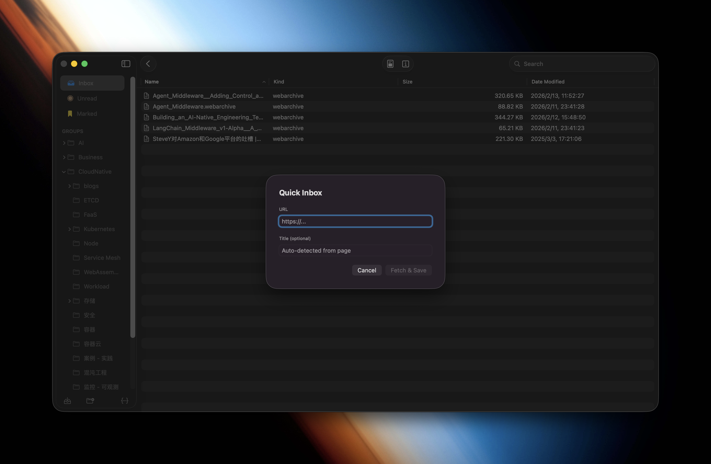
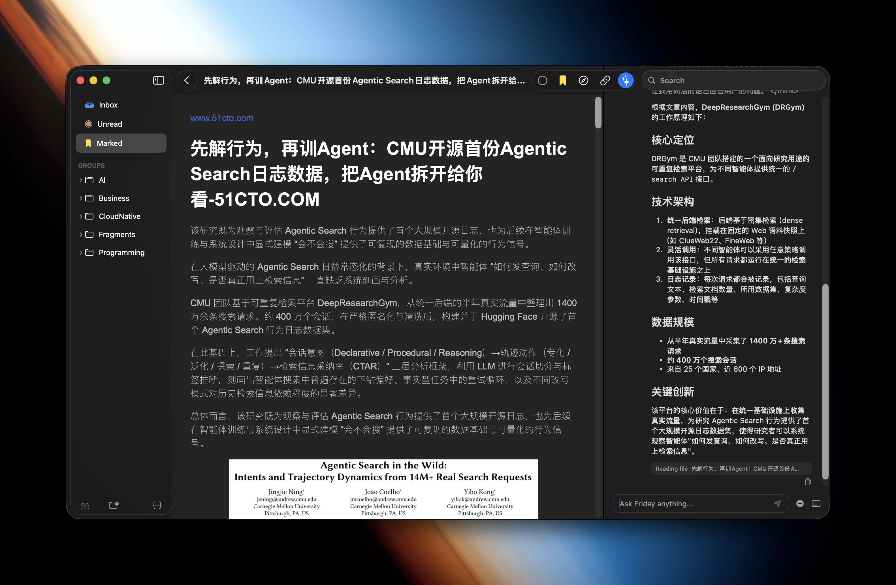
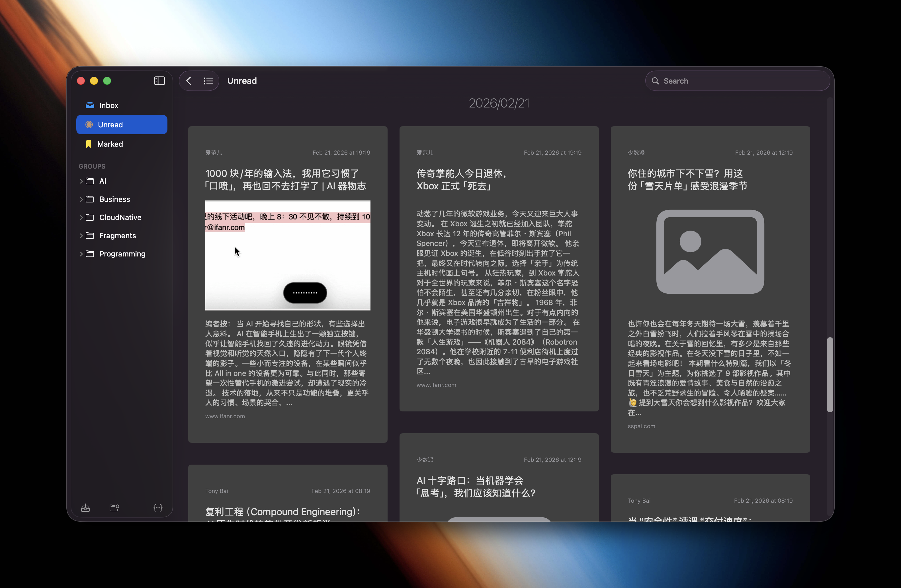

# Basenana

<p align="center">
  
</p>

<p align="center">
  <a href="https://github.com/nanafs/basenana/releases">
    
  </a>
  <a href="https://github.com/nanafs/basenana/blob/main/LICENSE">
    
  </a>
  <a href="https://github.com/nanafs/basenana">
    
  </a>
  <a href="https://github.com/nanafs/basenana/actions">
    
  </a>
</p>

basenana is the macOS client for [nanafs](https://nanafs.com), a cloud-oriented, file-first AI-powered personal knowledge management system.

## Features

### 📥 Quick Capture

Quickly capture web pages to Inbox via URL Scheme (`basenana://capture`), supports one-click capture from browser extensions, preserving the original web content for later reading.

### 📰 RSS Subscription

Sync RSS/Atom feeds to nanafs with:
- Automatic scheduled fetching
- Custom filter rules (CEL Pattern)
- Multi-format storage (HTML, XML, JSON, Markdown, WebArchive)

### 🤖 AI Assistant Friday

Interact with nanafs using LLM Agent:
- Natural language queries across your document library
- Document summarization and Q&A
- Chat with references to specific documents

### 📖 Document Reading

Multi-format document support:
- **PDF** - Full PDF rendering
- **HTML** - Web content reading
- **Markdown** - Markdown rendering
- **WebArchive** - Offline web archives

### 🔍 Full-text Search

Cross-document full-text search with highlighted results for quick content discovery.

### ⚙️ Workflow Automation

Flexible workflow engine with support for:
- RSS auto-fetch tasks
- Scheduled execution
- Local file monitoring triggers

## Screenshots

| Inbox | Document Reading |
|-------|-----------------|
|  |  |

| Unread | RSS Subscription |
|--------|------------------|
|  |  |

## Tech Stack

- **UI Framework**: SwiftUI
- **Architecture**: Clean Architecture
- **RSS Parsing**: [FeedKit](https://github.com/nmdias/FeedKit)
- **HTML Parsing**: [SwiftSoup](https://github.com/scinfu/SwiftSoup), [Fuzi](https://github.com/cezheng/Fuzi)
- **Layout**: [SwiftUIMasonry](https://github.com/Andrewmza/SwiftUIMasonry)
- **Dependency Injection**: [Swinject](https://github.com/Swinject/Swinject), [Factory](https://github.com/hmlongco/Factory)
- **Logging**: [SwiftyBeaver](https://github.com/SwiftyBeaver/SwiftyBeaver)

## Project Structure

```
basenana/
├── basenana/                   # App layer
│   ├── basenanaApp.swift       # App entry point
│   ├── DI/                     # Dependency injection
│   ├── Environment/            # Environment config
│   └── macOS/                  # macOS UI
├── Sources/
│   ├── Domain/                 # Domain layer (entities, use cases, protocols)
│   ├── Data/                   # Data layer (API clients, repositories)
│   ├── Feature/                # Feature layer (UI modules)
│   │   ├── Entry/              # Feed & capture
│   │   ├── Document/           # Document reading
│   │   └── Workflow/           # Workflow automation
│   └── Styleguide/             # Reusable UI components
└── Tests/                      # Unit tests
```

## Build Guide

### Prerequisites

- macOS 14.0+
- Xcode 15.0+

### Build Steps

```bash
# 1. Clone the project
git clone https://github.com/nanafs/basenana.git
cd basenana

# 2. Generate Xcode project
xcodegen generate

# 3. Open in Xcode
open basenana.xcodeproj

# 4. Build the project
# Cmd + B or
xcodebuild -project basenana.xcodeproj -scheme BasenanaApp -configuration Debug build
```

### Run Tests

```bash
xcodebuild test -scheme DomainTests
xcodebuild test -scheme DataTests
xcodebuild test -scheme FeatureTests
xcodebuild test -scheme StyleguideTests
```

## Requires nanafs Service

basenana requires the nanafs service to work. Visit [nanafs.com](https://nanafs.com) for more details.

## License

Apache License 2.0 - see [LICENSE](LICENSE) for details.

---

<p align="center">
  Made with ❤️ by nanafs
</p>
